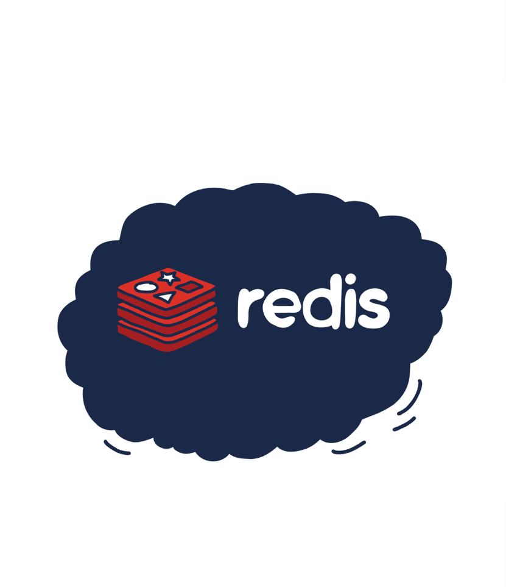
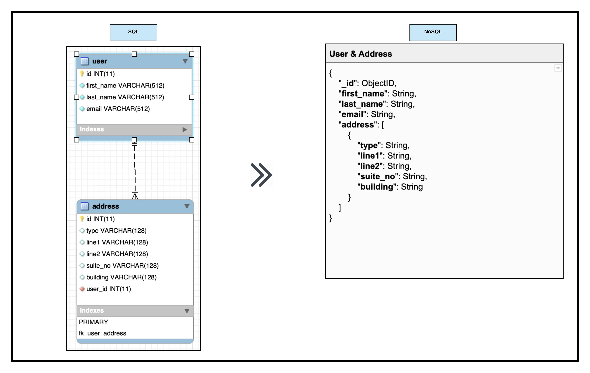
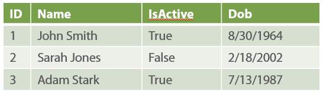
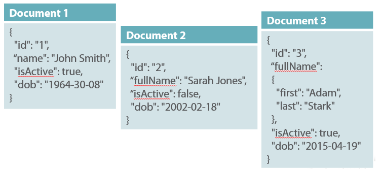
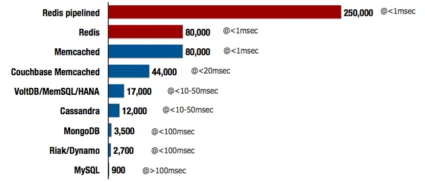
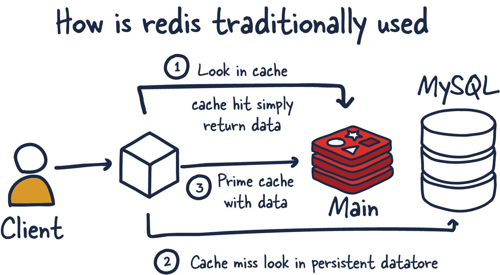
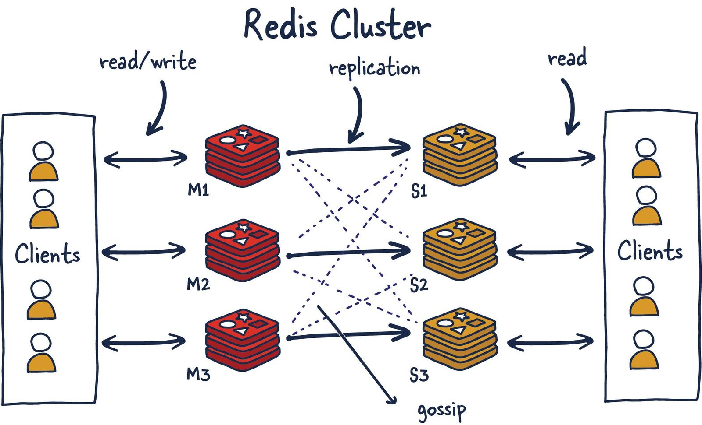

# redis-cache
## Redis


## NoSQL veritabani nedir?

NoSQL, "Not Only SQL" ifadesinin kisaltmasidir ve geleneksel SQL tabanli iliskisel veritabani yonetim sistemlerinden farkli olarak yapilandirilmis ve iliskisel olmayan verileri depolamak ve islemek icin kullanilan bir veritabani turudur. NoSQL veritabanlari genellikle buyuk veri miktarlarini hizli bir sekilde islemek, olceklenebilirlik saglamak ve esnek veri modellemesi yapmak icin kullanilir. NoSQL veritabanlari, cesitli turde veri depolama ihtiyaclarini karsilamak uzere cesitli modeller ve teknolojiler sunar.





## Redis Nedir?
Redis, open-source, in-memory veri yapisi deposudur ve  database, cache, ve message broker olarak kullanilabilir. Salvatore Sanfilippo tarafindan baslica olarak gelistirilen Redis, 2009 yilinda ilk olarak piyasaya suruldu ve o zamandan beri esnekligi, performansi ve kullanim kolayligi nedeniyle onemli bir populerlik kazandi.

Temelde, Redis bir key-value deposu olarak islev gorur, burada veriler bir key-value cifti koleksiyonu olarak saklanir. Ancak, Redis'i digerlerinden ayiran sey, basit key-value ciftlerinin otesinde cesitli veri yapilarini desteklemesidir. Bu veri yapilari arasinda strings, lists, sets, sorted sets, hashes, bitmaps, hyperloglogs ve daha fazlasi bulunur. Bu esneklik, gelistiricilerin veriyi, belirli kullanim durumlarina uyacak sekilde modellemesine ve islemesine olanak tanir.

Redis'in onemli ozelliklerinden biri, verileri baslica bellekte saklama(RAM) yetenegidir, bu da son derece hizli okuma ve yazma islemlerini mumkun kilar. Bu, sik erisilen verileri onbellege almak veya web uygulamalarinda oturum durumunu yonetmek gibi dusuk gecikmeli veri erisimini gerektiren uygulamalar icin Redis'i ozellikle uygun hale getirir.

Ayrica, Redis, verileri duzenli olarak diske kaydetmek icin yapilandirilabilen veri kaliciligi(persistence) secenekleri sunar. Bu, veri kaybinin sistem hatasi veya yeniden baslatma durumlarinda yasanmamasini saglar ve performans ile dayaniklilik arasinda bir denge olusturur.


---
Redis bellek uzerinde verileri saklar, bundan dolayi cok fazla bellek kisitlamasi vardir. Bos bir Instance(ornek) 1MB bellek kullanir. 1 milyon kucuk key-value <String,String>  eslemi 100MB yer kullanir.  Ben bu kadar basit veriler tutmayacagim benim verilerim daha karmasik derseniz, <Hash, Obj> seklindeki verilerin bir milyon adedi ise bellekte sadece 200mb yer kapliyor.

---

Redis(pipeline) 200.000 tane Request’i 1 milisaniyenin altinda isler. Memcached ile 1 saniyede 80.000 isi yapar. MySQL ile kiyaslarsak MySQL 100 milisaniyede 900 is yapar.

## Redis’in Ozellikleri Ve Avantajlari Nelerdir?

1. **Hizli ve Performansli**: Redis, bellek tabanli bir veri depolama sistemidir, bu da verilere hizli erisim ve isleme saglar. Icindeki verileri disk uzerinde degil, RAM'de saklar. Bu sayede yuksek performans elde edilir.
2. **Veri Yapilari Destegi**: Redis, cesitli veri yapilarini destekler, bunlar arasinda anahtar-deger ciftleri, listeler, kume (set), sirali kume (sorted set), ve hashler bulunur. Bu esneklik, cesitli uygulama senaryolari icin idealdir.
3. **Dagitik Sistemler ile Uyumlu**: Redis, dagitik sistemlerde kullanilmak uzere tasarlanmistir. Master-slave replikasyonu, yuk dengeleme, ve yuksek erisilebilirlik gibi ozellikler sunar.
4. **Yuksek Erisilebilirlik**: Redis, yuksek erisilebilirlik icin tasarlanmistir. Verilerin yedeklenmesi, master-slave replikasyonu ve otomatik basarisizlik algilama gibi ozellikler, sistemlerin kesintisiz calismasini saglar.
5. **Yonetimi Kolay**: Redis, basit bir yapiya sahiptir ve kullanimi kolaydir. Komut satiri arayuzu (CLI) ve cesitli programlama dilleri icin kutuphanelerle entegrasyonu kolaydir.
6. **Yuksek Esneklik**: Redis'in veri yapilari ve islevleri, cesitli kullanim durumlarina uyum saglayacak sekilde esnek olarak tasarlanmistir. Bu, farkli uygulama gereksinimlerine kolayca adapte olmayi saglar.
7. **Hafif ve Hizli Kurulum**: Redis, hafif bir yazilimdir ve kurulumu kolaydir. Cogu Linux dagitiminda paket yoneticileri araciligiyla veya kaynak kodundan derleyerek kolayca yuklenebilir.
8. **Yuksek Veri Yogunlugu ile Basa Cikma**: Redis, yuksek veri yogunlugu olan uygulamalarda etkili bir sekilde calisabilir. Bellek tabanli olmasi ve veri yapilarinin optimize edilmis olmasi, yuksek hacimli verilerle verimli bir sekilde basa cikmasini saglar.

## Redis'te Veri Yapilari ve Kullanimi

Redis, acik kaynakli bir anahtar-deger depolama sistemi ve veri yapisi sunucusudur. Anahtar-deger depolama modeli, her anahtarin bir degerle eslendigi basit bir veri modelidir. Redis, bu modeli kullanarak cesitli veri yapilari saglar ve bu yapilar genellikle veriyi islemek ve yonetmek icin kullanilir. Iste Redis'in sagladigi bazi temel veri yapilari ve kullanimlari:


1. **Strings (Dizeler)**: En temel veri yapisi olan dizeler, bir anahtarla iliskilendirilmis bir degerden olusur. Bu degerler metin, JSON verisi, sayilar veya diger turler olabilir. Dizeler, kullanici oturum bilgileri, sayim verileri gibi basit veri turlerini saklamak icin yaygin olarak kullanilir.

```bash
# Ornek kullanim
SET anahtar deger
GET anahtar

```

1. **Lists (Listeler)**: Sirali bir dizi veriyi iceren veri yapisidir. Listeler, sirali veri depolamak ve islemek icin kullanilir. Ornegin, bir kullanicinin gonderdigi son 10 mesaji saklamak icin listeler kullanilabilir.

```bash
# Ornek kullanim
LPUSH anahtar deger1 deger2 deger3
LRANGE anahtar 0 -1

```

1. **Sets (Kumeler)**: Benzersiz elemanlari iceren bir veri yapisidir. Kumeler, bir kullanicinin favori ogelerini saklamak veya bir konuda benzersiz ogeleri izlemek icin kullanilabilir.

```bash
# Ornek kullanim
SADD anahtar eleman1 eleman2 eleman3
SMEMBERS anahtar

```

1. **Hashes (Hash Tablolari)**: Anahtar-deger ciftlerini saklamak icin kullanilan bir veri yapisidir. Bir hash tablosu, bir kullanicinin profili gibi yapisal olmayan verileri saklamak icin kullanilabilir.

```bash
# Ornek kullanim
HSET anahtar altanahtar deger
HGET anahtar altanahtar

```

1. **Sorted Sets (Sirali Kumeler)**: Elemanlar arasinda sirali bir iliski olan veri yapisidir. Sirali kumeler, puanlama sistemleri veya sirali listeler gibi senaryolarda kullanilabilir.

```bash
# Ornek kullanim
ZADD anahtar puan eleman
ZRANGE anahtar 0 -1 WITHSCORES

```

Redis, bu temel veri yapilarina ek olarak daha gelismis yapilar da sunar ve bu yapilar genellikle karmasik veri yapilari ve sorgulamalari gerektiren uygulamalar icin kullanilir. Bu veri yapilari, Redis'in esnekligini ve performansini artirarak cesitli uygulama ihtiyaclarini karsilamak icin kullanilabilir.

## Redis Nerede ve Ne Zaman Kullanilir?

1. **Caching**: Redis, sik erisilen veriye hizli erisimi saglamak icin onbellekleme katmani olarak kullanilir. Sik erisilen veriyi bellekte saklayarak, Redis geleneksel disk tabanli veritabanlarina gore okuma islemlerinin gecikmesini onemli olcude azaltabilir.
2. **Session Store**: Redis, web uygulamalari icin oturum verilerini saklamak icin kullanilabilir. Oturum verilerini Redis'te saklamak, birden fazla sunucu veya ornek uzerinde hizli ve olceklenebilir oturum yonetimini saglar.
3. **Pub/Sub Messaging**: Redis, Pub/Sub Messaging iletisim modelini destekler, bu da gercek zamanli uygulamalarin (ornegin sohbet uygulamalari, canli guncellemeler, bildirimler) olusturulmasini saglar.
4. **Queueing**: Redis, listeler ve sirali kumeler gibi veri yapilarini saglayarak kuyruklari ve oncelikli kuyruklari uygulamak icin kullanilabilir. Gorev kuyruklari ve arka planda islem goren is sistemleri icin message broker olarak yaygin olarak kullanilir.
5. **Leaderboards and Counters(Siralama Listeleri ve Sayicilar)**: Redis, gercek zamanli skor tablolari olusturmak isteyen oyun gelistiriciler arasinda populer bir secimdir. Kullanici puanlarina gore siralanmis listeyi korurken ogelerin benzersizligini saglayan Redis Sorted Set veri yapisini kullanmaniz yeterlidir. Gercek zamanli bir dereceli liste olusturmak, bir kullanicinin puanini her degistiginde guncellemek kadar kolaydir. Puan olarak zaman damgalarini kullanarak zaman serisi verilerini islemek icin Sorted Sets’i de kullanabilirsiniz.
6. **Geospatial Indexing(Cografi Indeksleme)**: Redis, cografi konumlama ve sorgulama destegi sunar. Bu, konum tabanli hizmetler veya mekansal sorgular gerektiren uygulamalar icin yararlidir.
7. **Rate Limiting**: Redis, atomik islemler ve sona erme ozelliklerini kullanarak hiz sinirlama ve ayarlama mekanizmalarini uygulamak icin kullanilabilir.
8. **Full-Text Search**: Redis, kendisi tam metin arama yetenekleri saglamaz, ancak Redisearch veya RediSearch modulu gibi diger araclarla birlikte kullanilarak tam metin arama islevselligini uygulamak icin kullanilabilir.


## Caching Durumlarinda Dikkat Edilmesi Gerekenler
Ilk olarak bilmemiz gereken temel kural, cache edilmis verilerin orjinal verilerin kopyasi oldugudur. Surecte veritabanindaki orjinal verilerde olabilecek modifikasyonlar elbette cachelenmis verilerin bayatlamasina sebep olacaktirlar. Dolayisiyla, bu olasi duruma istinaden cachede tutulan verilerin belli bir zamandan sonra imha edilmesi ve veritabanindan tekrar elde edilmesi gerekmektedir. Aksi taktirde bu durumda uygulama bayat verilerle beslenmeye devam ederek, ongorulemez krizlere sebebiyet verebilir. Bunun icin cachede tutulacak veriler icin gecerlilik suresi(expiration time) tarafimizca konfigure edilerek olasi handikap kisirlastirilabilir.

## Redis sentine nedir?

Redis Sentinel, Redis'in yuksek erisilebilirlik ve otomatik basarisizlik yonetimi icin kullanilan bir bilesenidir. Redis Sentinel, Redis sunucularini izler, durumlarini kontrol eder ve otomatik olarak yeniden yapilandirma veya yedek sunuculari ana sunucu olarak tanimlama gibi eylemleri gerceklestirir.

Redis Sentinel'in temel ozellikleri sunlardir:

1. **Sunucu Izleme (Monitoring):** Redis Sentinel, Redis sunucularini surekli olarak izler ve durumlarini takip eder. Bu, sunucu baslatma, durdurma veya cokme durumlarinda hemen mudahale edilebilir.
2. **Otomatik Yedekleme (Automatic Failover):** Master Redis sunucusu coktugunde veya erisilemez hale geldiginde, Redis Sentinel otomatik olarak bir slave sunucuyu master sunucu olarak tanimlar. Boylece hizmet kesintisi minimuma indirilir.
3. **Yapilandirma Yonetimi (Configuration Management):** Redis Sentinel, Redis konfigurasyonunu yonetir ve degisiklikler yapabilir. Ornegin, yeni sunucular eklemek veya mevcut sunucularin yapilandirmasini degistirmek gibi islemler gerceklestirilebilir.
4. **Yuk Dengeleme (Load Balancing):** Redis Sentinel, talepleri ana ve yedek sunucular arasinda dengeli bir sekilde yonlendirir. Bu, hizmetin daha dengeli bir sekilde dagitilmasini saglar.

Redis Sentinel, Redis'in yuksek erisilebilirlik gereksinimlerini karsilamak ve hizmet kesintilerini en aza indirmek icin kullanilan onemli bir bilesendir.

## **Hangi Durumlarda Redis Sentinel’i Tercih Edebilirim?**

- **Redis Sunucusunun Arizalanmasi Durumunda**
- **Bakim ve Guncelleme Sureclerinde**
- **Yuksek Trafik**

## Redis Cluster nedir?

Redis Cluster, Redis'in dagitilmis bir veritabani cozumudur ve yuksek olceklenebilirlik ve yuksek erisilebilirlik gereksinimlerini karsilamak icin tasarlanmistir. Redis Cluster, birden fazla Redis dugumunu bir araya getirerek verileri parcalayip dagitarak calisir ve bu sayede buyuk veri kutlelerini islemek icin idealdir.

Redis Cluster'in bazi temel ozellikleri sunlardir:

1. **Dagitilmis Veri Depolama:**
   Redis Cluster, verileri farkli dugumlere dagitarak depolar. Bu, verilerin paralel olarak islenmesini ve yuksek performans elde edilmesini saglar.
2. **Yuksek Olceklenebilirlik:**
   Redis Cluster, dugumlerin eklenmesiyle olceklenebilir. Bu, artan veri ve talep yukleriyle basa cikmak icin esnek bir yapi saglar.
3. **Yuksek Erisilebilirlik:**
   Redis Cluster, yuksek erisilebilirlik seviyeleri saglar. Cunku her veri parcasi birden fazla dugumde replike edilir ve ana dugumun basarisiz olmasi durumunda otomatik olarak yedek dugumler devreye alinir.
4. **Parcali Veritabani:**
   Redis Cluster, verileri onceden belirlenmis parcalara (slotlara) ayirir ve bu parcalari farkli dugumlerde depolar. Bu sayede buyuk veri kutlelerini islemek icin optimize edilmistir.
5. **Dinamik Yapilandirma:**
   Redis Cluster, dugumlerin dinamik olarak eklenmesine veya kaldirilmasina olanak tanir. Bu, sistemde degisiklikler yapilmasini ve hizmetin kesintisiz olarak devam etmesini saglar.

Redis Cluster, dagitilmis uygulamalar icin guvenilir ve performansli bir veritabani cozumudur. Buyuk olcekli uygulamalarin gereksinimlerini karsilamak icin tasarlanmistir ve yuksek performans, olceklenebilirlik ve dayaniklilik saglar.

## Redis Sentinel ve Redis Cluster Tam olarak niye ihtiyac duyariz?(High Availability)
(Bu kisim bu makaleden alintidir: https://medium.com/@selcukusta/redisin-high-availability-%C3%A7%C3%B6z%C3%BCm%C3%BC-sentinel-d9c2b6b1a616)
<br>

<br>
Amacimiz Neo’yu yenmek. Bunun icin de elimizdeki en iyi ajan olan Smith’i, o zamana kadar mukemmel analiz ettigimiz Neo’nun karsisina tek basina gonderiyoruz, biliyoruz ki butun yetenegi ve dayanikliligiyla sorunsuz bir sekilde gorevini yerine getirebilir.

Ancak o da ne, bir sorun var! Neo hic yorulmuyor, kaynaklarini oldukca verimli kullaniyor. Bizim kaynaklarimiz ise tukenmek uzere. Bu istisnai duruma karsi bir senaryomuz yok, durumu tolere edemiyoruz **(fault-tolerance**) ve elimizdeki tek sistemi de kaybediyoruz. Artik tamamen savunmasiz haldeyiz.

### **Peki, elimizde 3 tane ayni yetenekte ajanimiz olsaydi?**

Boylece kaynagi tukenen ajan kenara cekilip dinlense, bir baskasi onun yerine gecip sistemi savunmaya devam etse ve bu yuku devretme **(failover)** islemi sistemli bir sekilde ilerlese. Sonsuza kadar — teoride — ayakta kalabilir miydik?

## Redis Persistence nedir?

Redis Persistence, Redis veritabaninda verilerin kalici olarak depolanmasi icin kullanilan bir mekanizmadir. Redis, verileri bellekte saklamakla birlikte, verilerin kalici olmasini saglayarak veri kaybini onler ve veri butunlugunu saglar. Redis Persistence'i saglamak icin uc temel yontem vardir:

1. **No Persistence (Kalicilik Yok):**
   Bu durumda, Redis verileri disk uzerinde kalici olarak depolanmaz. Yani, bellekteki veriler herhangi bir disk kaydina yazilmaz. Bu secenek, yuksek performans gerektiren uygulamalarda kullanilabilir, ancak sunucu yeniden baslatildiginda veya beklenmedik bir durumda veriler kaybolabilir.
2. **RDB Files (Snapshotting - Anlik Goruntuleme):**
   Bu yontemde, Redis belirli araliklarla tum veritabanini disk uzerine anlik bir goruntu olarak kaydeder. Anlik goruntu, veritabaninin belirli bir anindaki durumunu temsil eder. Bu dosyalar genellikle "dump.rdb" gibi adlandirilir. Snapshotting, genellikle disk kullanimini ve yedekleme surelerini azaltir, ancak son anlik goruntu arasindaki degisiklikler kaydedilmez.
3. **AOF (Append-Only File - Yalnizca Ekleme Dosyasi):**
   AOF yonteminde, Redis tum yazma islemlerini bir dosyaya kaydeder. Bu dosya, Redis'in yazma islemlerini sirali olarak kaydeder, boylece veri kaybi onlenir. Her yazma islemi dosyanin sonuna eklenir. Bu dosya genellikle "appendonly.aof" gibi adlandirilir. AOF dosyasi, Redis sunucusu yeniden baslatildiginda veya kurtarma islemi gerektiginde kullanilarak veritabani durumu geri yuklenir.

Bu uc Redis Persistence secenegi farkli avantajlar ve dezavantajlar sunar. No Persistence yuksek performans saglar ancak veri kaybi riski vardir. RDB Files anlik goruntu alirken disk alani kullanimini minimize eder. AOF ise veri kaybini onler ve daha guvenilir bir geri yukleme islemi saglar. Uygulama gereksinimlerine ve tercihlere bagli olarak, bu seceneklerden biri veya bir kombinasyonu secilebilir.

---
Uses Redis Cache to store user sessions.

1. **Redis Baglanti Ayarlari:**
   - `host`: Redis sunucusunun konumunu belirtir. Bu ornekte, Redis localhost'ta calisiyor gibi gorunmektedir.
   - `port`: Redis sunucunun dinledigi port numarasini belirtir. Bu ornekte, 6379 portu kullaniliyor.
   - `timeout`: Redis baglantisi icin zaman asimini belirtir. Bu ornekte, 10 saniye (10000 milisaniye) olarak ayarlanmis.

2. **Lettuce (Redis icin Java temelli bir istemci) Havuzu Ayarlari:**
   - `lettuce`: Bu bolum, Redis ile etkilesimde bulunmak icin kullanilan Lettuce kutuphanesinin ayarlarini icerir.
   - `pool`: Redis baglanti havuzu yapilandirmasi.
      - `max-active`: Eszamanli olarak etkin baglanti sayisini belirtir.
      - `max-wait`: Bir baglanti almak icin maksimum bekleme suresini belirtir. -1, belirli bir sure beklenmeksizin beklemek anlamina gelir.
      - `max-idle`: Havuzda izin verilen maksimum bos baglanti sayisini belirtir.
      - `min-idle`: Havuzda izin verilen minimum bos baglanti sayisini belirtir.

3. **Onbellek Ayarlari:**
   - `cache`: Spring Cache moduluyle ilgili genel onbellek ayarlarini icerir.
   - `type`: Kullanilacak onbellek turunu belirtir. Bu ornekte, Redis onbellegi kullaniliyor.
   - `redis`: Redis onbellek ozel ayarlarini icerir.
      - `time-to-live`: Onbellekteki bir ogenin ne kadar sureyle saklanacagini belirtir (saniye cinsinden).
      - `cache-null-values`: `true` olarak ayarlandiginda, onbellege `null` degerler de dahil edilir.

## Tech Stack

- Java 17
- Spring Boot 3.0
- Spring Data JPA
- Redis
- PostgreSQL
- Docker
- Lombok

## Requirements

For building and running the application you need:

- [JDK 17 or newer](https://www.oracle.com/java/technologies/javase-downloads.html)
- [Maven](https://maven.apache.org)
- [Redis](https://redis.io/)
- [PostgreSQL](https://www.postgresql.org/)
- [Lombok](https://projectlombok.org/)
- [Docker](https://www.docker.com/)

## Build & Run

```shell
  docker-compose -f docker-compose.yml up -d
```

```shell
  mvn clean install && mvn --projects backend spring-boot:run
```

## Kaynakca
- https://www.baeldung.com/spring-data-redis-tutorial
- https://medium.com/@humberto521336/what-is-redis-94c1930bd3c3
- https://architecturenotes.co/redis/
- https://redis.io/docs/latest/
- https://medium.com/@selcukusta/redisin-high-availability-%C3%A7%C3%B6z%C3%BCm%C3%BC-sentinel-d9c2b6b1a616
- https://medium.com/riseconsulting/redis-best-practises-a941c16c2933
- https://medium.com/intertechit/redis-sentinel-g%C3%BCvenilir-da%C4%9F%C4%B1t%C4%B1k-veri-tabanlar%C4%B1-9aee9f727acb
- https://fatmadelenn.medium.com/spring-boot-ve-caching-59156475df75
- https://metinalniacik.medium.com/spring-boot-cache-7a9e897195c3